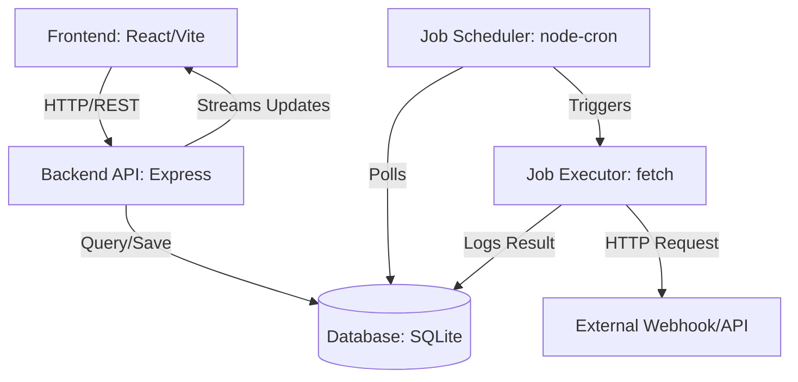

# CronCloud System Design

CronCloud is a distributed job scheduling platform designed to manage and execute HTTP-based automated tasks. This document outlines the system architecture, component design, and data flow for the current implementation (Phase 1).

## Architecture Overview

CronCloud follows a client-server architecture with a persistent data store.

## Core Components

### 1. Frontend (Client)
- **Dashboard**: Real-time view of job statuses and statistics.
- **Job Creation Modal**: Interface for configuring target URL, method, headers, body, and cron expressions.
- **History View**: Detailed logs of previous executions.
- **Services**: Abstracted API calls using `fetch`.

### 2. Backend (Server)
- **API Layer**: Express.js routes for CRUD operations on jobs and history.
- **Database Wrapper**: SQLite-based persistence using `sqlite3` and `sqlite`.
- **Scheduler Service**: Uses `node-cron` to maintain an in-memory map of active schedules. It initializes by loading all 'active' jobs from the database on startup.
- **Executor Service**: A stateless component that performs the actual HTTP requests and records the results (latency, status code, response body) into the `execution_history` table.

## Data Model

### Jobs Table
| Field | Type | Description |
| :--- | :--- | :--- |
| `id` | TEXT (PK) | Unique identifier (UUID/NanoID) |
| `name` | TEXT | Human-readable name |
| `url` | TEXT | Target execution endpoint |
| `method` | TEXT | HTTP Method (GET, POST, etc.) |
| `cronExpression` | TEXT | Standard crontab format |
| `status` | TEXT | `active` or `paused` |
| `lastExecution` | TEXT | ISO timestamp of last run |

### Execution History Table
| Field | Type | Description |
| :--- | :--- | :--- |
| `id` | TEXT (PK) | Unique identifier |
| `jobId` | TEXT (FK) | Reference to the parent job |
| `status` | TEXT | `success` or `failed` |
| `statusCode` | INTEGER | HTTP response status |
| `duration` | INTEGER | Execution time in milliseconds |
| `executedAt` | TEXT | Timestamp of execution |

## Data Flow

### Job Execution Lifecycle
1. **Trigger**: `node-cron` reaches the specified interval.
2. **Execute**: `jobExecutor` is called with job details.
3. **Request**: A `fetch` request is sent to the target `url`.
4. **Log**: The response status, body, and timing are saved to `execution_history`.
5. **Update**: The parent `jobs` table is updated with the `lastExecution` timestamp.

## Evolution Path

| Phase | Deployment | Database | Queue/Sync |
| :--- | :--- | :--- | :--- |
| **Phase 1** | Localhost | SQLite | node-cron (Internal) |
| **Phase 2** | Render/Vercel | PostgreSQL | BullMQ/Redis |
| **Phase 3** | AWS | DynamoDB | EventBridge/SQS |

---
**Status**: Document version 1.0 (Phase 1 focus)
